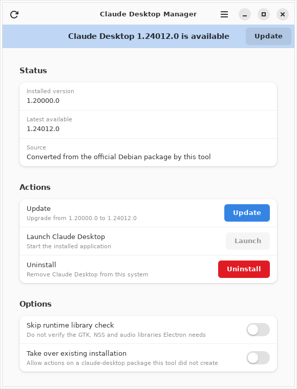
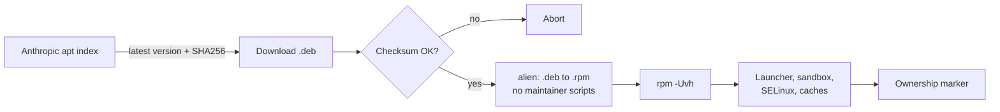

# Claude Desktop for Fedora: GUI Installer and Updater (Unofficial RPM)

Install, update and remove **Claude Desktop** on **Fedora Linux** with a native GTK app or two shell scripts.

Anthropic currently publishes the Claude Desktop Linux beta only as a `.deb` package for Ubuntu and Debian. This project downloads that official package directly from Anthropic, verifies its SHA256 checksum, converts it to an RPM with `alien`, and installs it with the right launcher, sandbox permissions and SELinux contexts. The result runs on Fedora like any other desktop app, and you can update it with one click.

> [!IMPORTANT]
> This is an unofficial community project. It is not affiliated with, endorsed by, or supported by Anthropic. Claude Desktop is proprietary software; this repository does not contain or redistribute it. Every install downloads the package from `downloads.claude.ai`.
> Made Completely using claude.ai



## Features

- **One-click install and update** of Claude Desktop on Fedora through a GTK 4 / libadwaita app that fits GNOME.
- **Update banner** when a newer Claude Desktop version is published.
- **Checksum verification:** every download is checked against the SHA256 in Anthropic's repository index before anything is installed.
- **No Debian maintainer scripts run on your system.** The steps that matter on Fedora (launcher, Electron sandbox, SELinux labels, desktop and icon caches) are done explicitly.
- **Safe uninstall:** refuses to touch a `claude-desktop` package it did not create, and never deletes a path owned by any installed RPM, so it cannot damage an official package later.
- **Password once per session** through polkit, with a strict allowlist of privileged actions.
- **Scripts included** for terminal users, servers or anyone who prefers no GUI.

## Tested on

| Fedora | Desktop | Arch | Claude Desktop | Result |
| --- | --- | --- | --- | --- |
| 44 | GNOME (Wayland) | x86_64 | 1.24012.0 | Works |

Other Fedora versions, desktops and aarch64 are untested. Reports are welcome as issues or pull requests to this table.

## Install

### Option 1: GUI app (recommended)

1. Download the latest `claude-deb2rpm-manager-*.noarch.rpm` from the [Releases](../../releases) page.
2. Install it:

   ```bash
   sudo dnf install ./claude-deb2rpm-manager-*.noarch.rpm
   ```

3. Open **Claude Desktop Manager** from the app grid, click **Install**, and enter your password when asked.
4. Click **Launch**, or open **Claude** from the app grid, and sign in.

### Option 2: Build the GUI rpm from source

```bash
git clone https://github.com/YOUR_GITHUB_USERNAME/claude-desktop-fedora-manager.git
cd claude-desktop-fedora-manager
./build.sh
sudo dnf install ./dist/claude-deb2rpm-manager-*.noarch.rpm
```

### Option 3: Scripts only, no GUI

```bash
git clone https://github.com/YOUR_GITHUB_USERNAME/claude-desktop-fedora-manager.git
cd claude-desktop-fedora-manager/scripts
./install-claude-deb-to-rpm.sh
```

The script uses `sudo` for the steps that need root and installs `alien` if it is missing.

| Option | Script | Effect |
| --- | --- | --- |
| `--skip-current` | install | Exit without changes if the latest version is already installed |
| `--no-deps` | install | Skip the runtime library check |
| `--keep-files` | install | Keep the downloaded deb and converted rpm in `/var/tmp` |
| `--force` | both | Act on a `claude-desktop` package this tool did not create (not recommended) |
| `--purge` | uninstall | Also delete your Claude Desktop settings, cache and app data |
| `-y` | uninstall | Do not prompt |

## Update Claude Desktop

The Linux app does not update itself. On Ubuntu, updates arrive through apt; on Fedora there is no official equivalent yet, so:

- **GUI:** a banner appears when a new version is available. Click **Update**.
- **Script:** run `./install-claude-deb-to-rpm.sh --skip-current`. It does nothing if you are already current, which makes it safe to run from a cron job or systemd timer.

Your sign-in and settings live in `~/.config/Claude` and are kept across updates.

## Uninstall, or switch to an official Fedora package

When Anthropic publishes an official RPM, remove this setup **first**, then install the official package:

1. In the app, click **Uninstall**. Leave "Also delete my Claude Desktop settings and data" unticked to stay signed in. From a terminal, run `./uninstall-claude-deb-to-rpm.sh` instead.
2. Install the official package following Anthropic's instructions.
3. Remove this tool: `sudo dnf remove claude-deb2rpm-manager`.

Removing this tool never removes Claude Desktop by itself, and the uninstall step refuses to remove a `claude-desktop` package that it did not create.

## How it works



- The installer reads Anthropic's apt repository index, picks the newest `claude-desktop` package for your architecture, and verifies the download against the SHA256 listed in that index.
- `alien` converts the package without `--scripts`, and `rpm` installs it with `--noscripts`, because Debian maintainer scripts expect `dpkg` and `apt`.
- `--replacefiles` is needed because alien claims `/usr/bin` and `/usr/lib`, which Fedora's `filesystem` package owns. `--nodeps` is needed because Debian dependency names do not match Fedora package names; the Electron runtime libraries are checked and installed separately.
- The script writes `/var/lib/claude-deb2rpm/installed`, which the uninstaller uses to confirm it owns the installed package.
- The GUI runs privileged work only through `/usr/libexec/claude-deb2rpm-manager/helper` via `pkexec`. The helper accepts `install` and `uninstall` with a fixed set of flags and rejects anything else. User data removal runs as you, never as root.

## FAQ

### Is there an official Claude Desktop for Fedora?

Not at the time of writing (September 2026). Anthropic's [Claude Desktop on Linux (beta)](https://code.claude.com/docs/en/desktop-linux) documentation lists Ubuntu 22.04+ and Debian 12+, and says support for Fedora, RHEL and other distributions is coming in the future. This project is a stopgap until then.

### How do I install Claude Desktop on Fedora?

Install the GUI rpm from [Releases](../../releases) and click **Install**, or run `scripts/install-claude-deb-to-rpm.sh`. See [Install](#install).

### Does it work on RHEL, Rocky Linux, AlmaLinux or CentOS Stream?

Untested. It needs `alien`, `dnf`, and for the GUI, libadwaita 1.5 or newer, which may not all be available on Enterprise Linux. Test reports are welcome.

### Does it work on openSUSE?

Not currently. The scripts use `dnf`. Pull requests for `zypper` support are welcome.

### Do Claude Code and Cowork work?

The app itself is Anthropic's Linux build, unmodified, so feature availability follows the official Linux beta. Check [Anthropic's Linux documentation](https://code.claude.com/docs/en/desktop-linux) for what the beta does not include yet.

### Does this redistribute Claude Desktop?

No. The repository and the release rpm contain only this project's scripts and GUI. Claude Desktop is downloaded from Anthropic on your machine at install time. Please do not share converted Claude Desktop rpms.

### Why alien instead of a hand-written RPM spec?

It tracks every upstream release automatically with no spec updates. The trade-off is that Debian dependency metadata is not mapped to Fedora names, which is why runtime libraries are checked separately. If you prefer a hand-mapped spec or a DNF repository, see [Alternatives](#alternatives).

## Troubleshooting

<details>

<summary>Claude Desktop does not start</summary>

Run `claude-desktop` from a terminal to see the error. Most failures are one of the items below.

</details>

<details>

<summary>Sandbox error mentioning chrome-sandbox</summary>

Reinstall from the app or run the install script again; it resets the sandbox helper to `root:root` with mode `4755`.

</details>

<details>

<summary>Blank window or GPU errors on Wayland</summary>

Try `claude-desktop --disable-gpu`. If that works, add the flag to the `Exec=` line of the Claude desktop entry.

</details>

<details>

<summary>Permission errors that are not missing libraries (SELinux)</summary>

Check for denials with `sudo ausearch -m avc -ts recent`. Reinstalling relabels the Claude files; do not disable SELinux.

</details>

<details>

<summary>"does not look like an alien conversion"</summary>

The installed `claude-desktop` was not created by this tool, for example an official package or another project's rpm. Nothing was changed. If you are sure it came from an earlier manual `alien` conversion, enable **Take over existing installation** in the app or pass `--force` once.

</details>

<details>

<summary>"Authentication cancelled"</summary>

The polkit password prompt was dismissed or your account is not an administrator. Nothing was changed.

</details>

## Alternatives

Other community projects solve the same problem in different ways. Pick whichever suits you; none of them, including this one, is official.

| Project | Approach |
| --- | --- |
| [mkemel/claude-desktop-fedora-repackage](https://github.com/mkemel/claude-desktop-fedora-repackage) | Repackages the official `.deb` with a spec that maps Debian dependencies to Fedora names |
| [sharpandpearl/claude-desktop-fedora-rpm](https://github.com/sharpandpearl/claude-desktop-fedora-rpm) | Builds a Fedora rpm locally from Anthropic's official Linux build |
| [dewzor/claude-desktop-fedora](https://github.com/dewzor/claude-desktop-fedora) | Local rpm build from the official Linux build, with a daily update timer |
| [patrickjaja/claude-desktop-bin](https://github.com/patrickjaja/claude-desktop-bin) | Prebuilt packages and repositories for several distributions |
| [aaddrick/claude-desktop-debian](https://github.com/aaddrick/claude-desktop-debian) | Build scripts that repackage the Windows app for Linux; upstream of several forks |

## Contributing

See [CONTRIBUTING.md](CONTRIBUTING.md). Test reports from other Fedora versions, desktops and aarch64 are the most useful contribution right now.

## License

The scripts and GUI in this repository are released under the [MIT License](LICENSE). Claude Desktop is proprietary software by Anthropic and is governed by Anthropic's terms.

Claude and Anthropic are trademarks of Anthropic, PBC. They are used here only to describe what this tool installs.
